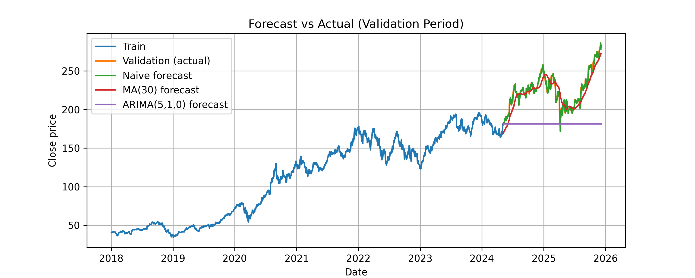

# 📈 Stock Price Forecasting — Time Series Modeling (AAPL)

A financial forecasting project using Python to model, predict, and evaluate stock closing prices for Apple (AAPL).  
This project tests classical forecasting models and compares their performance on unseen future data.

---

## Project Structure

```bash
financial-forecasting/
│
├── data/
│   ├── raw/                  # original AAPL CSV data
│   └── processed/            # (optional) cleaned saves
│
├── notebooks/
│   ├── 01_eda.ipynb          # visual exploration + trend analysis
│   └── 02_models.ipynb       # forecasting + evaluation
│
├── src/
│   ├── data_loading.py       # load + split train/validation
│   ├── models.py             # naive / MA / ARIMA models
│   ├── metrics.py            # MAE, MAPE, RMSE
│   └── plot_utils.py         # final comparison plot + saving
│
└── reports/figures/
    └── aapl_forecast_comparison.png   # final chart output
```

## 🎯 **Goal of the Project**

-Build a time-series forecasting pipeline for stock prices

-Compare baseline forecasting models

-Evaluate predictive accuracy using industry-standard metrics

-Visualise performance vs actual future prices

-This simulates a real workflow used in quant trading, risk modeling & investment forecasting.


## 📊 **Models Implemented**
| Model                       | Description                                                  |
| --------------------------- | ------------------------------------------------------------ |
| **Naive Forecast**          | Assumes tomorrow’s price will be the same as today |
| **Moving Average (30-day)** | Uses the average of the last 30 days to smooth out ups/downs        |
| **ARIMA (5,1,0)**           | Looks at past price patterns to make short-term predictions   |


## 🧪 **Evaluation Metrics**

| model | MAE | MAPE | RMSE |
|---|---|---|---|
| naive | **2.64** | **1.19%** | **3.91** |
| ma_30 | 9.11 | 4.08% | 11.28 |
| arima_5_1_0 | 44.04 | 18.76% | 49.32 |

> The naive model produced the lowest error — confirming that short-term market movement behaves close to a random walk.  
> ARIMA and MA lagged the price trend, increasing prediction error.


## 📈 **Visualisation — Forecast vs Actual**


<p align="center">
  
</p>


## Interpretation

To understand how well each model predicted AAPL's future price movement, we compared three approaches and measured their errors on unseen data. The results were surprisingly clear:

| Model                       | MAE ↓    | MAPE ↓    | RMSE ↓   |
| --------------------------- | -------- | --------- | -------- |
| **Naive Forecast**          | **2.64** | **1.19%** | **3.91** |
| **Moving Average (30-day)** | 9.11     | 4.08%     | 11.28    |
| **ARIMA (5,1,0)**           | 44.04    | 18.76%    | 49.32    |

The naive model — the simplest one — delivered the most accurate predictions.

Why did the simplest model win?

Because stock prices tend to behave like a random walk.
There is often no predictable pattern day-to-day, and the best guess for tomorrow is often just today's price. This is exactly what the naive model does — and since the validation data was sequential, it stayed extremely close to the real movement.

In simple terms:

> When prices move unpredictably, guessing "tomorrow ≈ today" is surprisingly hard to beat.

### Why the Moving Average and ARIMA struggled

| Model                     | Why it underperformed                                                                                 |
| ------------------------- | ----------------------------------------------------------------------------------------------------- |
| **30-day Moving Average** | Smooths volatility, but reacts too slowly when price changes quickly — it lags behind the real trend  |
| **ARIMA(5,1,0)**          | Tried to learn patterns that weren’t strong enough — so it flattened the forecast and missed movement |

These models weren’t “wrong” — they just weren’t a strong match for noisy market data without more features (news events, volume, macro trends, etc.). In other scenarios like retail sales or web traffic, they might outperform naive. Stocks are simply more chaotic.

### What we can conclude

-Simple baselines matter — and sometimes win.

-A model isn’t better just because it's more advanced.

-Real-world forecasting requires adding information beyond price alone.

This experiment mirrors what happens in finance:

>Beating a naive forecast in liquid markets is extremely hard —
which is why genuine trading models rely on deep feature engineering, not price alone.


## **Run the Project Locally**
```
git clone <repo-url>
cd financial-forecasting
python -m venv .venv && source .venv/bin/activate
pip install -r requirements.txt
jupyter notebook
```
Made with Python & Data
